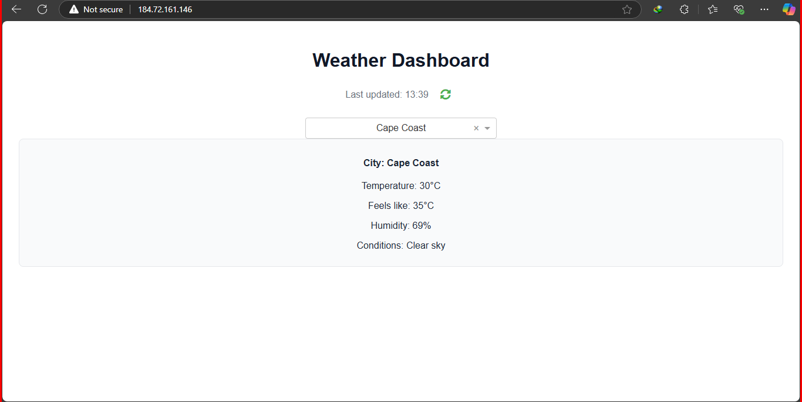

# Darko's Weather Widget


Darko's Weather Widget is a web application that displays current weather information for some popular cities in Ghana. The data is fetched from the OpenWeather API and stored in an AWS S3 bucket. The application is built using Dash, a web application framework for Python.

## Features

- Displays current weather information for selected cities
- Fetches weather data from OpenWeather API
- Stores weather data in an AWS S3 bucket
- Updates weather information periodically
- Provides a user-friendly interface

## Getting Started

### Prerequisites

- Python 3.x
- pip (Python package installer)
- AWS account
- OpenWeather API key

### Installation

1. Clone the repository:
    ```sh
    git clone https://github.com/Kdarks3215/weather_dashboard.git
    cd weather_dashboard
    ```

2. Create and activate a virtual environment:
    ```sh
    python3 -m venv venv
    source venv/bin/activate
    ```

3. Install the required packages:
    ```sh
    pip install -r requirements.txt
    ```

4. Set up your environment variables:
    - Create a `.env` file in the project root directory with the following content:
        ```plaintext
        OPENWEATHER_API_KEY=your_openweather_api_key
        AWS_BUCKET_NAME=your_aws_s3_bucket_name
        AWS_ACCESS_KEY_ID=your_aws_access_key
        AWS_SECRET_ACCESS_KEY=your_aws_secret_key
        ```
    - Replace the placeholders with your actual OpenWeather API key and AWS credentials.

### Running the App

1. Run the Dash app locally:
    ```sh
    python app.py
    ```

2. Access the app in your web browser at `http://127.0.0.1:8099`.

### Hosting on EC2 with IAM Role for S3 Access

1. **Launch an EC2 instance**:
    - Launch an EC2 instance with Amazon Linux 2 AMI.
    - Configure security group to allow inbound traffic on port 8099.

2. **Create an IAM role**:
    - Go to the IAM console and create a new role.
    - Select "AWS service" and "EC2" as the use case.
    - Attach the "AmazonS3FullAccess" policy or a custom policy that allows S3 access.
    - Complete the role creation process.

3. **Attach the IAM role to your EC2 instance**:
    - Go to the EC2 console.
    - Select your instance, click "Actions," then "Security," and "Modify IAM role."
    - Select the IAM role you created and attach it to the instance.

4. **Connect to your EC2 instance**:
    ```sh
    ssh -i /path/to/your-key-pair.pem ec2-user@your-ec2-public-dns
    ```

5. **Install necessary packages**:
    ```sh
    sudo yum update -y
    sudo yum install python3 python3-venv git -y
    ```

6. **Clone the repository and set up the environment**:
    ```sh
    git clone https://github.com/Kdarks3215/weather_dashboard.git
    cd weather_dashboard
    python3 -m venv venv
    source venv/bin/activate
    pip install -r requirements.txt
    ```

7. **Set environment variables**:
    - Create a `.env` file with your OpenWeather API key and S3 bucket name (no need for AWS credentials as the IAM role handles access).
    ```plaintext
    OPENWEATHER_API_KEY=your_openweather_api_key
    AWS_BUCKET_NAME=your_aws_s3_bucket_name
    ```

8. **Run the app with Gunicorn**:
    ```sh
    nohup gunicorn -w 2 -b 0.0.0.0:8099 app:server &
    ```

9. **Access the app**:
    - Open your web browser and navigate to `http://your-ec2-public-dns:8099`.

## Usage

- Select a city from the dropdown menu to view the current weather information.
- Click the refresh button to manually update the weather data.
- The app automatically updates the weather data every hour.

---

_Enjoy your weather dashboard!_ ☀️☁️🌧️
